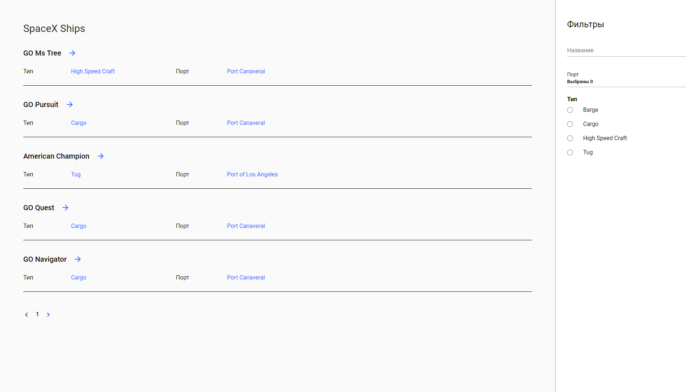

# SpaceX ships
Сайт для просмотра информации о кораблях SpaceX.
Состоит из двух страниц:
- Страница со списком всех кораблей
- Страница с информацией о выбранном корабле
## Использовано:
- Angular
- RxJS
- GraphQL API ([SpaceX ships](https://api.spacex.land/graphql/))
- Apollo.js

## Реализовано:
- Пагинация
- Роутинг
- Лоадер
- Фильтрация по:
-- Названию
-- Порту (множественный выбор) (выпадающее меню)
-- Типу

## Внешний вид:
Внешний вид списка кораблей:  
 
Внешний вид списка кораблей c фильтрацией:  
.png) 
Внешний вид карточки корабля:
 
